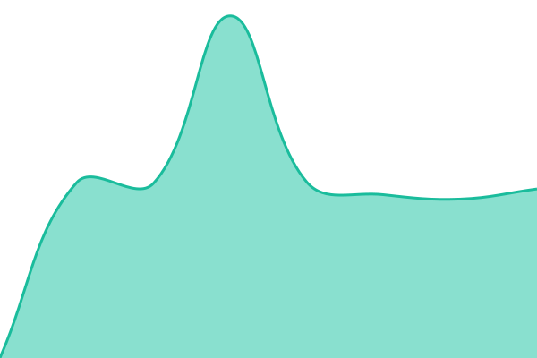

# [📈 Live Status](https://demo.upptime.js.org): <!--live status--> **🟩 All systems operational**

This repository contains the open-source uptime monitor and status page for [12si27](https://demo.upptime.js.org), powered by [Upptime](https://github.com/upptime/upptime).

With [Upptime](https://upptime.js.org), you can get your own unlimited and free uptime monitor and status page, powered entirely by a GitHub repository. We use [Issues](https://github.com/12si27/1227-uptime/issues) as incident reports, [Actions](https://github.com/12si27/1227-uptime/actions) as uptime monitors, and [Pages](https://demo.upptime.js.org) for the status page.

<!--start: status pages-->
<!-- This summary is generated by Upptime (https://github.com/upptime/upptime) -->
<!-- Do not edit this manually, your changes will be overwritten -->
<!-- prettier-ignore -->
| URL | Status | History | Response Time | Uptime |
| --- | ------ | ------- | ------------- | ------ |
|  [1227 OpenCloud Main Server](https://cloud.1227.kr/ping/) | 🟩 Up | [1227-open-cloud-main-server.yml](https://github.com/12si27/1227-uptime/commits/HEAD/history/1227-open-cloud-main-server.yml) | 

 767ms
     
 | 

<a href="https://status.1227.kr/history/1227-open-cloud-main-server">100.00%</a>
    

|  [1227 OpenCloud Sub Server](https://cloud-stream-sub.1227.kr/ping) | 🟩 Up | [1227-open-cloud-sub-server.yml](https://github.com/12si27/1227-uptime/commits/HEAD/history/1227-open-cloud-sub-server.yml) | 

 618ms
     
 | 

<a href="https://status.1227.kr/history/1227-open-cloud-sub-server">100.00%</a>
    

|  [1227 Encoder](https://encoder.1227.kr) | 🟩 Up | [1227-encoder.yml](https://github.com/12si27/1227-uptime/commits/HEAD/history/1227-encoder.yml) | 

 716ms
     
 | 

<a href="https://status.1227.kr/history/1227-encoder">100.00%</a>
    

<!--end: status pages-->

[**Visit our status website →**](https://demo.upptime.js.org)

## 📄 License

- Powered by: [Upptime](https://github.com/upptime/upptime)
- Code: [MIT](./LICENSE) © [Anand Chowdhary](https://anandchowdhary.com), supported by [Pabio](https://pabio.com)
- Data in the `./history` directory: [Open Database License](https://opendatacommons.org/licenses/odbl/1-0/)
